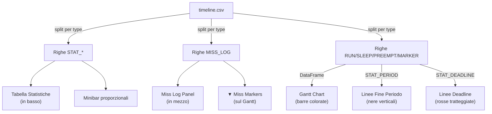

# Come il Python legge il CSV — Guida Dettagliata

Questo documento spiega come `monitorRealTime.py` legge `timeline.csv` e produce la visualizzazione grafica.

---

## 1. Parsing del CSV: `load_csv()`

Il CSV viene letto riga per riga. Ogni riga viene classificata in tre categorie:

```python
with open(path, "r") as fh:
    fh.readline()  # salta l'header "task,type,start,end,duration_ms"

    for line in fh:
        parts = line.strip().split(",")
        task  = parts[0].strip()
        etype = parts[1].strip()
```

### 1.1 Righe `STAT_*` → Statistiche pre-calcolate

```python
if etype.startswith("STAT_"):
    stat_key = etype[5:].lower()  # "STAT_WCET" → "wcet"
    val = float(parts[4])
    stats_raw[task][stat_key] = val
```

Ogni task accumula un dizionario di chiavi statistiche:

| Chiave CSV | Chiave Python | Significato |
|-----------|--------------|-------------|
| `STAT_PERIOD` | `period` | Periodo atteso (ms) |
| `STAT_MEASURED` | `measured` | Periodo misurato (mediana, ms) |
| `STAT_DEADLINE` | `deadline` | Deadline (ms) |
| `STAT_WCET` | `wcet` | Worst Case Execution Time (ms) |
| `STAT_ACET` | `acet` | Average Case Execution Time (ms) |
| `STAT_JITTER` | `jitter` | Jitter del periodo (ms) |
| `STAT_UTIL` | `util` | Utilizzo CPU (0.0–1.0) |
| `STAT_NRUN` | `nrun` | Numero segmenti RUN |
| `STAT_NPRE` | `npre` | Numero segmenti PREEMPT |
| `STAT_NSLP` | `nslp` | Numero segmenti SLEEP |
| `STAT_NMISS` | `nmiss` | Numero deadline miss |
| `STAT_WSLACK` | `wslack` | Worst slack (ms, negativo = miss) |
| `STAT_RUNTOT` | `runtot` | Tempo RUN totale (ms) |
| `STAT_PRETOT` | `pretot` | Tempo PREEMPT totale (ms) |
| `STAT_SLPTOT` | `slptot` | Tempo SLEEP totale (ms) |
| `STAT_HGAPS` | `hgaps` | Ha gap? (1.0 / 0.0) |
| `STAT_NGAPS` | `ngaps` | Numero di gap |
| `STAT_MAXGAP` | `maxgap` | Gap massimo (ms) |

### 1.2 Righe `MISS_LOG` → Registro dei miss

```python
elif etype == "MISS_LOG":
    ps_abs = float(parts[2])        # timestamp assoluto del PERIOD_START
    ps_rel = float(parts[3])        # relativo all'inizio del trace
    fields = parts[4].split("|")    # "200.0|280.0|80.0|2"
    misses.append(dict(
        task=task,
        ps_abs=ps_abs,
        ps_rel=ps_rel,
        deadline_ms=float(fields[0]),    # 200.0
        response_ms=float(fields[1]),    # 280.0
        overshoot_ms=float(fields[2]),   # 80.0
        period_idx=int(fields[3]),       # 2
    ))
```

### 1.3 Righe normali → DataFrame per il Gantt

```python
else:
    start = float(parts[-3])
    end   = float(parts[-2])
    dur   = float(parts[-1])
    # parts[1:n-3] possono contenere virgole (es. MARKER_xxx,yyy)
    prefix = parts[: len(parts) - 3]
    task   = prefix[0].strip()
    etype  = ",".join(prefix[1:]).strip()
    rows.append((task, etype, start, end, dur))
```

Il risultato viene convertito in DataFrame Pandas:

```python
df = pd.DataFrame(rows, columns=["task","type","start","end","duration_ms"])
df.sort_values("start", kind="mergesort", inplace=True)
```

---

## 2. Conversione Stats Raw → Stats Map

I valori grezzi vengono trasformati nel formato usato internamente dal renderer:

```python
for task, raw in stats_raw.items():
    period_ms = raw.get("period", 0)
    period_ms = period_ms if period_ms > 0 else None  # 0 → None

    measured_ms = raw.get("measured", -1)
    measured_ms = measured_ms if measured_ms > 0 else None  # -1 → None

    run_tot = raw.get("runtot", 0)   # in ms
    pre_tot = raw.get("pretot", 0)
    slp_tot = raw.get("slptot", 0)

    stats_map[task] = dict(
        total_state = (run_tot + pre_tot + slp_tot) / 1000.0,  # → secondi
        dur = {
            "RUN":     run_tot / 1000.0,     # → secondi
            "PREEMPT": pre_tot / 1000.0,
            "SLEEP":   slp_tot / 1000.0,
        },
        period_ms   = period_ms,
        deadline_ms = deadline_ms,
        wcet        = raw.get("wcet", 0),
        utilization = raw.get("util", 0),
        n_misses    = int(raw.get("nmiss", 0)),
        worst_slack = worst_slack,
        # ... e tutti gli altri campi
    )
```

> [!NOTE]
> I tempi totali vengono divisi per 1000 perché le barre proporzionali (minibar) nel grafico lavorano in secondi.

---

## 3. Separazione nel Renderer: `build_chart()`

Il DataFrame viene separato in due sottoinsiemi:

```python
states  = df[df["type"].isin(STATE_TYPES)].copy()
# → righe RUN, PREEMPT, SLEEP (per le barre del Gantt)

markers = df[~df["type"].isin(STATE_TYPES)].copy()
# → righe MARKER_* (per posizionare le linee periodo verticali)
```

### 3.1 Normalizzazione temporale (t=0 = inizio trace)

```python
t0 = df["start"].min()     # timestamp assoluto minimo
states["start"]  -= t0     # ora t=0 corrisponde all'inizio
states["end"]    -= t0
markers["start"] -= t0
markers["end"]   -= t0
```

---

## 4. Disegno del Gantt Chart

### 4.1 Barre di stato colorate

Per ogni riga stato, disegna un rettangolo colorato:

```python
for _, row in states.iterrows():
    task = row["task"]
    yc   = task_to_y[task]        # posizione Y della lane
    t_s  = row["start"]
    t_e  = row["end"]
    col  = {"RUN": "#43A047", "PREEMPT": "#E53935", "SLEEP": "#90A4AE"}[row["type"]]

    ax.broken_barh(
        [(t_s, t_e - t_s)],       # (inizio, durata)
        (yc - BAR_H/2, BAR_H),    # (y_bottom, altezza)
        facecolors=col
    )
```

### 4.2 Linee Fine Periodo (griglia ideale)

Usa il `STAT_PERIOD` di ciascun task per disegnare linee nere verticali a intervalli regolari:

```python
period_ms = stats_map[task]["period_ms"]
period_s  = period_ms / 1000.0
t0_task   = float(task_states["start"].min())  # primo RUN del task

k = 1
while True:
    fp_x = t0_task + k * period_s   # posizione X della k-esima linea
    if fp_x > x_max:
        break

    ax.plot([fp_x, fp_x], [yc - LANE_H/2, yc + LANE_H/2],
            color="#212121",      # nero
            linewidth=1.8)

    k += 1
```

### 4.3 Linee Deadline (se diversa dal periodo)

```python
if deadline_ms is not None and deadline_ms != period_ms:
    period_start_x = t0_task + (k - 1) * period_s
    dl_x = period_start_x + deadline_ms / 1000.0

    ax.plot([dl_x, dl_x], [yc - LANE_H/2, yc + LANE_H/2],
            color="#C62828",      # rosso
            linewidth=1.2,
            linestyle="--")       # tratteggiata
```

---

## 5. Disegno dei Deadline Miss

### 5.1 Calcolo posizioni grafiche

Per ogni miss dal CSV, calcola le coordinate X sul Gantt:

```python
for m in all_misses:
    m["ps_rel_adj"] = m["ps_abs"] - t0        # relativo al trace start
    m["dl_x"]  = m["ps_rel_adj"] + m["deadline_ms"] / 1000.0
    #            ↑ periodo_start    ↑ deadline in secondi
    m["fe_x"]  = m["ps_rel_adj"] + m["response_ms"] / 1000.0
    #                               ↑ FUNCTION_END relativo al periodo
```

### 5.2 Rendering grafico

```python
# 1. Triangolo ▼ rosso alla posizione della deadline
ax.plot(dl_x, yc + BAR_H/2 + 0.05,
        marker="v", color="#FF1744", markersize=10)

# 2. Barra rossa orizzontale = overshoot (da deadline a FUNCTION_END)
ax.hlines(yc, dl_x, fe_x, colors="#FF1744", linewidth=4.5, alpha=0.75)

# 3. Label "+Xms" sopra la barra
ax.text((dl_x + fe_x) / 2, yc + BAR_H/2 + 0.25,
        f"+{overshoot_ms:.0f}ms", color="#FF1744")

# 4. Label "!N" contatore miss per task
ax.text(dl_x, yc + BAR_H/2 + 0.42,
        f"!{counter}", color="#FF1744")
```

---

## 6. Tabella Statistiche: `draw_stats_table()`

Per ogni task, i valori vengono letti direttamente da `stats_map`:

```python
for i, task in enumerate(all_tasks):
    s = stats_map[task]

    vals = [
        task,
        f"{s['period_ms']:.2f}",         # Periodo atteso
        f"{s['measured_ms']:.2f}",        # Periodo misurato
        f"{s['deadline_ms']:.2f}",        # Deadline
        f"{s['wcet']:.2f}",              # WCET
        f"{s['acet']:.2f}",              # ACET
        f"{s['jitter_ms']:.2f}",         # Jitter
        f"{s['utilization']*100:.1f}",   # Util %
        str(s['n_run']),                 # nRUN
        str(s['n_preempt']),             # nPRE  (rosso se > 0)
        str(s['n_sleep']),               # nSLP
        str(s['n_misses']),              # Miss  (rosso se > 0)
        f"{s['worst_slack']:.1f}",       # W.Slack (rosso se < 0)
        f"{s['n_gaps']}x{s['max_gap_ms']:.0f}",  # Gap
    ]
```

### Minibar proporzionale

Sotto ogni riga della tabella, una barra mostra le proporzioni RUN/PREEMPT/SLEEP:

```python
denom = s["total_state"]   # tempo totale in secondi
for tt in ("RUN", "PREEMPT", "SLEEP"):
    frac = s["dur"][tt] / denom     # frazione 0.0–1.0
    ax.add_patch(Rectangle(
        (cx, by), frac * bw, bh,    # larghezza proporzionale
        facecolor={"RUN":"#43A047","PREEMPT":"#E53935","SLEEP":"#90A4AE"}[tt]
    ))
    if frac > 0.06:
        ax.text(..., f"{frac*100:.0f}%")  # label percentuale
```

---

## 7. Pannello Miss Log: `_draw_miss_log()`

Se ci sono miss, viene aggiunto un pannello dedicato in mezzo:

```python
for i, m in enumerate(all_misses):
    vals = [
        str(i + 1),                  # #
        m["task"],                   # Task
        str(m["period_idx"]),        # Numero periodo
        f"{m['ps_abs']:.3f}",        # Timestamp assoluto
        f"{m['ps_rel'] * 1000:.1f}", # Timestamp relativo (ms)
        f"{m['deadline_ms']:.1f}",   # Deadline (ms)
        f"{m['response_ms']:.1f}",   # Response time (ms)
        f"+{m['overshoot_ms']:.1f}", # Overshoot (ms)
    ]
```

---

## 8. Riepilogo del Flusso Dati


