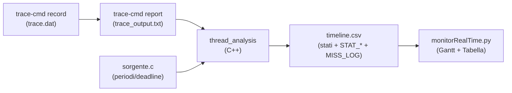

# Pipeline: da `trace.dat` alla Visualizzazione Python

## Panoramica del Flusso



---

## Fase 0 — Registrazione (`run_trace.sh`)

```bash
sudo trace-cmd record -e sched:sched_switch -e sched:sched_wakeup \
     -o "$OUTPUT_DIR/trace.dat" "$EXECUTABLE"
```

Il kernel registra ogni `sched_switch` (cambio di contesto) e ogni `sched_wakeup`. I marker scritti dal programma utente (via `trace_marker`) vengono catturati come eventi `tracing_mark_write`.

```bash
trace-cmd report "$OUTPUT_DIR/trace.dat" > "$OUTPUT_DIR/trace_output.txt"
```

Converte il binario in testo leggibile. Ogni riga ha il formato:

```
   Activity_1-1234  [001]  1306.299646: print:  tracing_mark_write: PERIOD_START_Activity_1
```

---

## Fase 1 — Lettura Sorgente C ([thread_analysis.cpp](file:///home/leonardo/eprosima_projects/flight_sensor/flight_sensor/Tesi/Brugali/src/app/parser/thread_analysis.cpp#L88-L126))

Estrae **periodo** e **deadline** dal file `.c` dell'applicazione tramite regex:

```cpp
// Regex per trovare: sprintf(activities[0].name, "Ciao")
std::regex name_re(R"(sprintf\s*\(\s*([a-zA-Z0-9_\[\]]+)\.name\s*,\s*"([^"]+)")");
// Regex per trovare: activities[0].period = 250
std::regex period_re(R"(([a-zA-Z0-9_\[\]]+)\.period\s*=\s*(\d+))");
// Regex per trovare: activities[0].deadline = 200
std::regex deadline_re(R"(([a-zA-Z0-9_\[\]]+)\.deadline\s*=\s*(\d+))");
```

Costruisce due mappe: `expected_periods["Ciao"] = 2.0` (sec) e `expected_deadlines["Ciao"] = 2.0` (sec).

---

## Fase 2 — Discovery Dinamica dei Thread ([thread_analysis.cpp](file:///home/leonardo/eprosima_projects/flight_sensor/flight_sensor/Tesi/Brugali/src/app/parser/thread_analysis.cpp#L128-L218))

### Passo 1 — Scansione marker

Qualsiasi thread che scrive `tracing_mark_write` viene automaticamente tracciato:

```cpp
if (event.find("print") != std::string::npos ||
    event.find("tracing_mark_write") != std::string::npos) {
  marker_pids[pid] = comm;  // scoperto automaticamente!
}
```

Questa logica è **completamente dinamica**: non importa se il thread si chiama `Activity_1`, `Ciao` o `uccello`.

### Passo 2 — Associazione periodi

Per ogni PID scoperto, prova a ripristinare il nome completo (Linux tronca a 15 char) cercando nelle `expected_periods`:

```cpp
for (const auto &kv : expected_periods) {
  if (kv.first.find(comm) == 0) {  // "Activity_1".find("Activity_") == 0
    full_name = kv.first;
    break;
  }
}
tasks[pid].expected_period_sec = expected_periods[full_name];
```

### Passo 3 — Raccolta eventi

Per ogni PID tracciato, raccoglie:
- **`switch_in`**: timestamp di quando il thread entra in esecuzione
- **`switch_out`**: timestamp + stato (`R`=preempted, `S`=sleep, `D`=blocked)
- **`markers`**: testo dei marker (`PERIOD_START_Ciao`, `FUNCTION_END_Ciao`, ecc.)

---

## Fase 3 — Costruzione Intervalli e Statistiche ([thread_analysis.cpp](file:///home/leonardo/eprosima_projects/flight_sensor/flight_sensor/Tesi/Brugali/src/app/parser/thread_analysis.cpp#L220-L370))

### Costruzione RUN / SLEEP / PREEMPT

```cpp
// Accoppiamo switch_in[i] con switch_out[j] per creare intervalli RUN
while (i < switch_in.size() && j < switch_out.size()) {
  if (switch_out[j].time > switch_in[i]) {
    run.push_back({switch_in[i], switch_out[j].time});
    i++; j++;
  } else { j++; }
}

// I gap tra RUN consecutivi diventano SLEEP o PREEMPT
char state = switch_out[k].state;
if (state == 'S' || state == 'D')  → SLEEP
if (state == 'R')                  → PREEMPT
```

---

## Calcolo di ogni Statistica

### Periodo Misurato (`STAT_MEASURED`)

Mediana dei gap temporali tra marker `PERIOD_START` consecutivi:

```cpp
for (size_t g = 1; g < pstart.size(); g++)
  gaps.push_back(pstart[g] - pstart[g - 1]);
std::sort(gaps.begin(), gaps.end());
measured_ms = gaps[gaps.size() / 2] * 1000.0;  // mediana
```

### Jitter (`STAT_JITTER`)

Deviazione standard dei gap tra `PERIOD_START`:

```cpp
double mean_gap = sum(gaps) / gaps.size();
double var = 0;
for (double g : gaps)
  var += (g - mean_gap) * (g - mean_gap);
jitter_ms = sqrt(var / gaps.size()) * 1000.0;
```

### WCET e ACET (`STAT_WCET`, `STAT_ACET`)

Tempo di RUN totale **per singolo job** (da `PERIOD_START` a `PERIOD_END`), non il singolo segmento RUN:

```cpp
// Somma dei segmenti RUN che si sovrappongono a [PERIOD_START, PERIOD_END]
inst_run_ms = state_time_in(tdata.run, ps, pe) * 1000.0;

// state_time_in calcola l'overlap:
for (const auto &iv : intervals) {
  double overlap = min(iv.end, hi) - max(iv.start, lo);
  if (overlap > 0) total += overlap;
}

wcet_ms = max(wcet_ms, inst_run_ms);  // peggior caso
acet_ms = sum_run_ms / job_count;      // caso medio
```

> [!IMPORTANT]
> Un task preemettato 10 volte in un periodo ha 10 micro-segmenti RUN. Il WCET è la **somma** di tutti, non il massimo singolo.

### Utilization (`STAT_UTIL`)

```cpp
if (calc_period_sec > 0 && pstart.size() >= 2) {
  double denom = (pstart.size() - 1) * calc_period_sec;
  util = (total_run_ms / 1000.0) / denom;
} else {
  util = (total_run_ms / 1000.0) / csv_span_s;  // fallback
}
```

Formula: **U = Σ RUN / (N_periodi × T_periodo)**

### Deadline Miss (`STAT_NMISS`, `STAT_WSLACK`, `MISS_LOG`)

Usa il marker `FUNCTION_END` per determinare il **response time** reale:

```cpp
// Trova l'ultimo FUNCTION_END tra PERIOD_START e PERIOD_END
double response_ms = (func_end_t - ps) * 1000.0;
double slack_ms = deadline_ms - response_ms;

if (slack_ms < 0) {
  n_misses++;
  // Scrivi MISS_LOG: task, timestamp, deadline, response, overshoot
}

worst_slack_ms = min(worst_slack_ms, slack_ms);
```

> [!NOTE]
> Un periodo senza `FUNCTION_END` (skip period) **non** viene contato come miss.

### Gaps (`STAT_HGAPS`, `STAT_NGAPS`, `STAT_MAXGAP`)

Misura i "buchi" tra segmenti RUN consecutivi (tutti, non solo per periodo):

```cpp
for (size_t g = 1; g < tdata.run.size(); g++) {
  double gap = tdata.run[g].start - tdata.run[g - 1].end;
  if (gap > 1e-6) {
    n_gaps++;
    max_gap_ms = max(max_gap_ms, gap * 1000.0);
  }
}
```

---

## Output: `timeline.csv`

Il CSV finale contiene tre tipologie di righe:

| Tipo | Esempio | Usato per |
|------|---------|-----------|
| **Stato** | `Ciao,RUN,1306.29,1306.35,60.0` | Gantt chart |
| **Marker** | `Ciao,MARKER_PERIOD_START_Ciao,1306.29,1306.29,0.0` | Linee periodo |
| **Statistica** | `Ciao,STAT_WCET,0,0,101.256` | Tabella statistiche |
| **Miss Log** | `Ciao,MISS_LOG,1306.5,0.2,200\|250\|50\|3` | Pannello miss |

---

## Fase Finale — Visualizzazione Python ([monitorRealTime.py](file:///home/leonardo/eprosima_projects/flight_sensor/flight_sensor/Tesi/Brugali/src/app/parser/monitorRealTime.py))

Il Python **non calcola nulla**. Legge `timeline.csv` e separa:
- Righe `RUN/SLEEP/PREEMPT` → disegna il **Gantt chart** con barre colorate
- Righe `MARKER_*` → posiziona simboli (▲ per PERIOD_START, ▼ per PERIOD_END)
- Righe `STAT_*` → popola la **tabella statistiche** in basso
- Righe `MISS_LOG` → popola il **pannello Deadline Miss Log**

Le **linee Fine Periodo** (nere verticali) e **Deadline** (rosse tratteggiate) vengono disegnate come griglia ideale partendo dal `STAT_PERIOD` e `STAT_DEADLINE` di ogni task.
